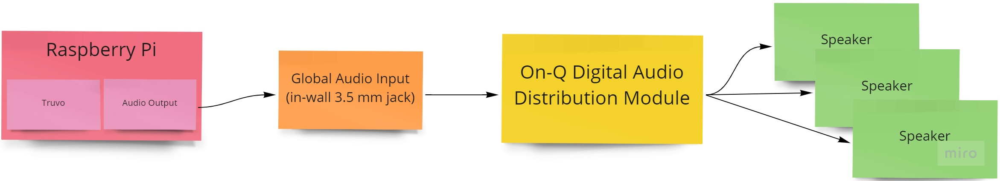
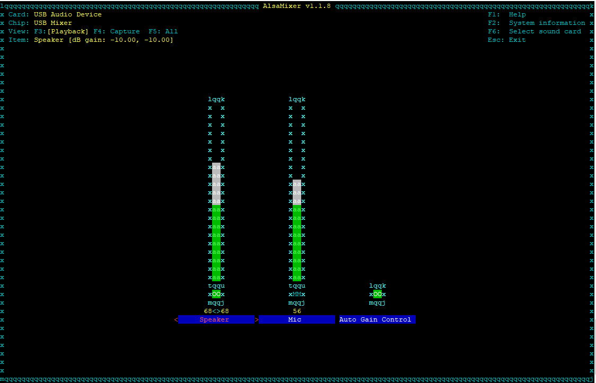

# truvo

Delivering the true promise of a NuVo/On-Q multi-room audio system

## Features

* Auto-discover configured audio zones
* Stream audio through your NuVo system via Airplay

## Setup

`truvo` was designed to run on a Raspberry Pi connected to a "Global Audio Input" jack in the NuVo system (i.e. https://www.legrand.us/data-communications/av-connectivity/av-control-devices/digital-audio-global-source-input-nickel/p/au7007wh)



Although the Raspberry Pi has a built-in 3.5mm headphone jack, the quality and volume are not great. Therefore, it's recommended to use a USB sound card.

## Installation

1) Install `shairport-sync` binary with `alsa` support (https://github.com/mikebrady/shairport-sync)

2) Edit `config.ini` to match your setup:

* `OutputDevice`: Name of your Raspberry Pi's audio output device. This can be found by running `shairport-sync -h`. Example:

```
<...snip...>

Settings and options for the audio backend "alsa":
    -d output-device    set the output device, default is "default".
    -c mixer-control    set the mixer control name, default is to use no mixer.
    -m mixer-device     set the mixer device, default is the output device.
    -i mixer-index      set the mixer index, default is 0.
    hardware output devices:
      "hw:Device"
      "hw:Headphones"
```

In this example, `OutputDevice` would be set to `hw:Device` to use the USB sound card

* `MixerControlName`: Name of your output device's hardware mixer. This can be found by running `alsamixer`. Example:
* `GlobalSourceId`: The ID of your global input source configured in NuVo (ex: `S3`)



In this example, `MixerControlName` would be set to `Speaker`

3) Run `python3 truvo.py`

## Usage

Once `truvo` is running, you should see an AirPlay target for each configured zone in your NuVo system. Streaming to this target will power on the selected zone and start streaming audio. The zone will be set to 50% volume and the volume can then be tweaked further with the AirPlay device's volume control.

## Development

### Linting

`pylint truvo`

### Testing

`pytest truvo`
